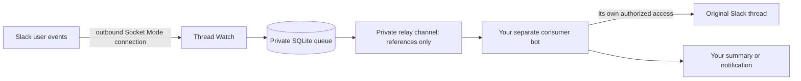

# Thread Watch

A self-hosted Slack watcher that forwards message references to a private relay
channel. Run it continuously on a Mac or an AWS Linux instance.

It watches exact mentions of one configured user, optionally watches every new
message in selected channels, and can follow subsequent replies in mentioned
threads. A durable SQLite queue deduplicates events, retries definite failures,
and quarantines uncertain delivery to avoid automatic duplicate posts.

**The continuous worker is a metadata relay.** It does not generate AI summaries,
research topics, or read full threads. A separate consumer bot must receive the
references, access the original source using its own authorized Slack connection,
and implement any summaries or private delivery you want. That consumer and its
credentials are not included in this repository. An offline heuristic summary
demo and separately gated, bounded local experiments are included.



Socket Mode uses an outbound WebSocket connection. The continuous worker needs
internet access, but no public domain, inbound server port, ngrok, or Cloudflare
Tunnel. Remote administration is a separate concern; SSH over a private network
can be used independently.

## Try it offline

Use Node.js 24 and Python 3.12 or newer. The minimum Node version is 22.18;
Python must be at least 3.10. The hosted platforms are macOS and Linux.

```sh
git clone https://github.com/Moriyan1307/thread-watch-oss.git
cd thread-watch-oss
npm ci --ignore-scripts
npm run demo
npm test
npm run typecheck
npm run build
npm run manifest:check
python3 -m unittest discover -s test -p '*_test.py'
```

The demo and tests use synthetic identities and offline adapters. They do not
connect to Slack, create cloud resources, or read installed credentials. Tests
cover filtering, authentication/scope gates, acknowledgements after persistence,
deduplication, retries, crash recovery, relay privacy, worker leases, fresh Mac
state, and a second installation with a different workspace and user.

GitHub Actions runs these checks on macOS and Linux with Node 24 and Python 3.12,
and scans committed history for secrets. Native login-Keychain integration is
an optional owner-run test, skipped by default; see [macOS setup](docs/macos.md).
These checks cannot establish that your Slack installation or external consumer
is working. Verify a natural qualifying event after installation.

## Configure your own Slack installation

1. Create a Slack app in your workspace using [manifest.json](manifest.json).
   Obtain an app-level token with **only** `connections:write`, a user token for
   the person being monitored, and a bot token for this watcher app. Workspace
   administrators may need to approve the installation.
2. Confirm the tokens' workspace/user/bot/app identities and scopes. The user
   grants are `channels:history`, `groups:history`, `im:history`, `mpim:history`;
   the bot grants are `chat:write`, `im:write`. The implicit user `identify`
   scope is recognized. Unexpected or missing scopes cause startup rejection.
3. Prepare your separate relay consumer. Create a **private** relay channel with
   exactly three members: the monitored user, watcher bot, and consumer bot.
   Verify privacy and membership manually in Slack before approving it. The
   watcher has no channel-directory/member-list grants and cannot verify these
   facts itself or detect subsequent membership changes.
4. Copy `.env.example` to `.env` and fill the nonsecret configuration below.
   Use plain `KEY=value` lines without quotes, spaces around `=`, or shell
   substitutions. **Never put Slack tokens in this file.**

```sh
cp .env.example .env
chmod 600 .env
```

| Configuration | Value to supply |
| --- | --- |
| `RADAR_TEAM_ID`, `RADAR_USER_ID` | Your workspace ID and monitored user's ID |
| `RADAR_APP_ID`, `RADAR_CONFIRMED_SEPARATE_APP_ID` | The same watcher app ID, distinct from the consumer app |
| `RADAR_BOT_USER_ID`, `RADAR_BOT_ID` | Watcher bot user ID (`U…`) and bot ID (`B…`) |
| `RADAR_PROCESSOR_USER_ID` | Consumer bot's user ID (`U…`) |
| `RADAR_RELAY_CHANNEL_ID` | Verified private relay channel ID |
| `RADAR_RELAY_MEMBER_USER_IDS` | Exactly the three user IDs above, comma-separated without spaces |
| `RADAR_RELAY_VERIFIED_PRIVATE` | `approved` only after manual verification |
| `RADAR_VERIFIED_APP_SCOPES` | `connections:write`, verified during app-token setup |
| `RADAR_ALLOW_SLACK_CONNECTION`, `RADAR_ALLOW_SLACK_READS`, `RADAR_ALLOW_PRIVATE_RELAY` | `approved` after reviewing access and destination |
| `RADAR_ALLOW_CONTINUOUS`, `RADAR_DEPLOYMENT_APPROVED` | `approved` for continuous hosting |
| `RADAR_WATCH_CHANNEL_IDS` | Optional comma-separated exact channel IDs; leave empty for mention-only monitoring |
| `RADAR_ALLOW_CHANNEL_MONITORING` | `approved` when watch channels are configured; otherwise leave empty |
| `RADAR_FOLLOW_MENTION_THREADS` | `approved` to follow later replies; otherwise leave empty |

The `RADAR_` variable names and `Radar source v1/v2` relay headers are retained for
protocol compatibility. `examples/demo.env` contains synthetic fixtures only;
never use its identities as a live installation configuration. Identity
configuration is fixed at process startup; restart to apply changes.

The user token can access message history, including private conversations
available to that user. Review that access and any channel monitoring with your
workspace. Continuous relay mode persists IDs/timestamps and empty source text;
original text is still received transiently with Slack events. Job records expire
after 24 hours, ending their dedupe window; followed-thread references persist
until the operator removes state. Relay posts remain subject to Slack retention.
The bounded local summary experiment can store source text until delivery or
expiry and requires separate private-DM approval.

## Host it

- [macOS setup](docs/macos.md): login Keychain, a user LaunchAgent, fresh database
  activation, and restart/recovery limits.
- [AWS setup](docs/aws.md): parameterized CloudFormation, encrypted EBS queue,
  Secrets Manager, SSM administration, and a Linux systemd worker.
- [Relay contract](docs/relay-contract.md): what a consumer receives and how to
  handle it safely.

Run only one active worker for an installation. `npm start` and Slack CLI
start/deploy hooks deliberately fail closed; they do not bypass owner setup.

## Contribute

See [CONTRIBUTING.md](CONTRIBUTING.md) and [SECURITY.md](SECURITY.md).
Licensed under [MIT](LICENSE).
